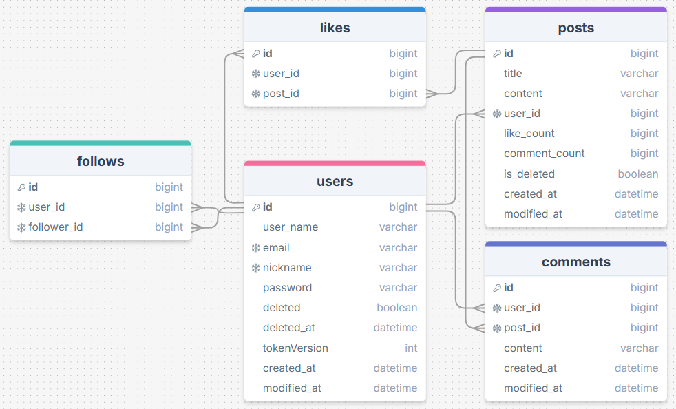

# 🐷 삼겹Gram (뉴스피드 프로젝트)

## 1. 프로젝트 소개 
### 💡 한줄 소개
> 유저들의 일상을 공유하고 연결하는 공간입니다!

### 🎯 프로젝트 목적
- 사용자 간 정보 공유와 개인 타임라인 구축을 통한 소통 강화

### ✨ 주요 기능 요약
- 유저: 유저 생성, 조회, 수정, 삭제
- 포스트: 게시물 생성, 조회, 수정, 삭제
- 댓글: 댓글 생성, 조회, 수정, 삭제
- 팔로우: 팔로우/언팔로우, 팔로워·팔로잉 조회
- 좋아요: 게시물 좋아요 생성/취소

---

## 2. 기술 스택 

| 영역 | 기술 |
|------|-------|
| **Language** | Java 17 |
| **Framework** | Spring Boot 3.5.7, Spring Web |
| **ORM** | Spring Data JPA |
| **Security** | Spring Security, JWT |
| **Validation** | Jakarta Validation |
| **Library** | Lombok |
| **Database** | MySQL, MySQL Driver |
| **Build Tool** | Gradle |
| **Tools** | IntelliJ IDEA, Postman |
| **Version Control** | Git / GitHub |
| **Data Format** | JSON |

---

## 3. 시스템 구조 

### 🗂️ ERD


### 📁 디렉토리 구조 
```bash
com.example.project
├── comment
│   ├── controller
│   │   └── CommentController.java
│   ├── model
│   │   ├── request
│   │   │   ├── CreateCommentRequest.java
│   │   │   └── UpdateCommentRequest.java
│   │   └── response
│   │       ├── CreateCommentResponse.java
│   │       ├── GetCommentResponse.java
│   │       └── UpdateCommentResponse.java
│   ├── repository
│   │   └── CommentRepository.java
│   └── service
│       └── CommentService.java
│
├── common
│   ├── entity
│   │   ├── BaseEntity.java
│   │   ├── Comment.java
│   │   ├── Follow.java
│   │   ├── Like.java
│   │   ├── Post.java
│   │   └── User.java
│   ├── exception
│   │   ├── CustomException.java
│   │   ├── ErrorCode.java
│   │   └── GlobalExceptionHandler.java
│   ├── model
│   │   └── dto
│   │       └── ErrorCodeResponse.java
│   └── utils
│       └── PasswordEncoder.java
│
├── follow
│   ├── controller
│   │   └── FollowController.java
│   ├── model
│   │   ├── request
│   │   │   └── FollowRequest.java
│   │   └── response
│   │       └── FollowResponse.java
│   ├── repository
│   │   └── FollowRepository.java
│   └── service
│       └── FollowService.java
│
├── like
│   ├── controller
│   │   └── LikeController.java
│   ├── model
│   │   ├── response
│   │   │   └── LikeResponse.java
│   │   └── request
│   ├── repository
│   │   └── LikeRepository.java
│   └── service
│       └── LikeService.java
│
├── post
│   ├── controller
│   │   └── PostController.java
│   ├── dto
│   │   ├── request
│   │   │   ├── CreatePostRequest.java
│   │   │   └── UpdatePostRequest.java
│   │   └── response
│   │       ├── CreatePostResponse.java
│   │       ├── ReadPostResponse.java
│   │       └── UpdatePostResponse.java
│   ├── repository
│   │   └── PostRepository.java
│   └── service
│       └── PostService.java
│
├── security
│   ├── config
│   │   └── SecurityConfig.java
│   ├── jwt
│   │   ├── JwtAuthenticationEntryPoint.java
│   │   ├── JwtAuthenticationFilter.java
│   │   └── JwtUtil.java
│   └── util
│       └── SecurityUtil.java
│
├── user
│   ├── controller
│   │   └── UserController.java
│   ├── model
│   │   ├── request
│   │   │   ├── CreateUserRequest.java
│   │   │   ├── DeleteUserRequest.java
│   │   │   ├── LoginRequest.java
│   │   │   └── UpdateUserRequest.java
│   │   └── response
│   │       ├── CreateUserResponse.java
│   │       ├── GetOtherUserResponse.java
│   │       ├── GetUserResponse.java
│   │       ├── LoginResponse.java
│   │       └── UpdateUserResponse.java
│   ├── repository
│   │   └── UserRepository.java
│   └── service
│       └── UserService.java
│
└── ProjectApplication.java
```
---

## 4. 구현 기능

### 👤 User
- 회원가입
- 로그인, 로그아웃
- 마이페이지, 타 유저 페이지 조회
- 내 정보 수정
- 회원탈퇴

### 📝 Post
- 게시글 생성
- 게시글 조회 (페이징, 기간별 조회)
- 게시글 수정
- 게시글 삭제

### 💬 Comment
- 댓글 생성
- 댓글 조회 (페이징 조회)
- 댓글 수정
- 댓글 삭제

### 🤝 Follow
- 팔로우 생성
- 팔로우 취소
- 팔로워, 팔로잉 목록 조회

### ❤️ Like
- 좋아요 생성
- 좋아요 취소

---

## 5. API 명세 
> https://www.notion.so/teamsparta/3-2b22dc3ef51480a8a326f941bc904010

---

## 6. 트러블 슈팅 
### #️⃣ Git 협업 문제
**🔍 문제점**
- 여러 팀원이 동시에 같은 파일을 수정하면서 브랜치 충돌(Conflict) 반복
- .gitignore 설정 미흡으로 빌드 파일 등이 레포지토리에 포함되는 문제 발생
- main, dev 브랜치 용도가 혼동되어 작업 흐름 불안정

**🛠 해결**
- 팀 규칙 통일: Pull → 작업 → Commit → Push 순서 준수 (PR 후 공지)
- 프로젝트 공통 .gitignore 파일 재정비
- 브랜치 전략 확립
    - main : 배포용
    - dev : 기능 개발용

**🎯 효과**
- 충돌 빈도 감소로 협업 효율 증가
- 코드베이스 정돈
- 안정적인 브랜치 구조 확립

### #️⃣ Follow 관계 설계
**🔍 문제점**
- 팔로워/팔로잉 구조를 2개의 테이블로 나눌 것인지, 1개의 Follow 테이블로 통합할 것인지 논의 발생
- 2개 테이블 → 직관적이지만 데이터 중복 심함
- 1개 테이블 → 중복은 없지만 조회 시 비교 로직 증가

**🛠 해결**
- 최종적으로 1개의 Follow 테이블(follower_id, user_id) 로 결정
- 데이터 중복 제거 & 구조 단순화 우선 고려

**🎯 효과**
- 데이터 관리 용이
- 확장성 및 유지보수성 향상
- 테이블 구조 안정화

### 3️⃣ Soft Delete 설계
**🔍 문제점**
- 삭제 여부를 어떤 방식으로 필터링할지 팀 내 의견 차이
- 엔티티에 @Where로 자동 필터링
- Repository에서 JPQL로 isDeleted = false 조건 추가
- 기능별로 필요하는 조회 방식이 달라 충돌 발생

**🛠 해결**
- 기능 특성에 맞게 방식 혼합 적용
- User 엔티티 → @Where(clause = "deleted = false")
- Post/Comment 등 복잡한 조회는 Repository JPQL에서 직접 필터링

**🎯 효과**
- 삭제된 데이터 노출 방지
- 조회 성능 및 유연성 확보
- 기능별로 최적의 soft delete 전략 적용 가능

---

## 7. 팀원 역할 (Contributors & Roles)

| 이름  | 역할                                   |
|-----|--------------------------------------|
| 김진찬 | 게시물 CRUD                             |
| 권민서 | 게시물 CRUD                             |
| 김동욱 | 유저 기능 (마이페이지, 타 유저페이지 조회 / 유저 삭제)    |
| 오은지 | 유저 기능 (회원가입, 내 정보 수정)                |
| 이다희 | JWT(로그인, 로그아웃), 비밀번호 암호화, 좋아요 기능     |
| 최정혁 | 유저 기능 (회원가입), 댓글 CRUD, 팔로우 기능, 예외 처리 |

---

## 8. 실행 방법 (How to Run)

### 🔧 환경 변수 설정
- 프로젝트 실행을 위해 아래 환경 변수를 설정해야 합니다. (OS 환경 변수 또는 프로젝트 루트의 .env 파일 사용 가능)
- `JWT_SECRET=<YOUR_JWT_SECRET>`

### ▶️ 실행 방법
1. **프로젝트 클론**
```bash
git clone https://github.com/jhyeok-design/newsfeedProject.git
````
2. application.properties 설정
- src/main/resources/application.properties 파일을 아래 형식에 맞춰 설정합니다.
```
spring.application.name=project

spring.datasource.url=jdbc:mysql://localhost:3306/newsfeed
spring.datasource.username=<DB_USERNAME>
spring.datasource.password=<DB_PASSWORD>
spring.datasource.driver-class-name=com.mysql.cj.jdbc.Driver

spring.jpa.hibernate.ddl-auto=create
spring.jpa.properties.hibernate.dialect=org.hibernate.dialect.MySQL8Dialect
spring.jpa.show-sql=true
spring.jpa.properties.hibernate.format_sql=true

jwt.secret=${JWT_SECRET}
```
- <DB_USERNAME>과 <DB_PASSWORD>는 직접 로컬에서 사용하는 값으로 변경하세요.
3. Gradle 빌드
- ```./gradlew build```

4. Spring Boot 실행
- ```./gradlew bootRun```
- (또는 IntelliJ → ProjectApplication.java 실행)

---

